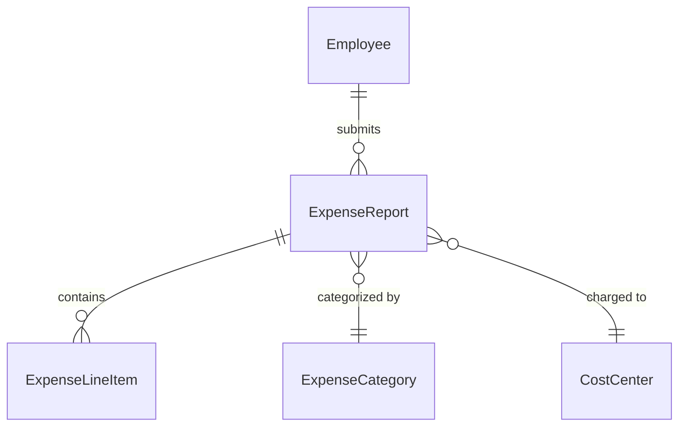
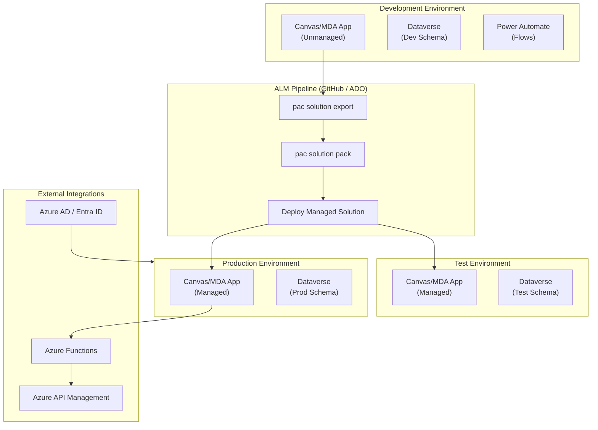

# Power Apps Architect Skill

Design robust, enterprise-grade Microsoft Power Apps solutions following Power Platform best practices, governance principles, and ALM (Application Lifecycle Management) standards.

## When to Use This Skill

- Designing a new Power Apps solution from scratch (canvas or model-driven)
- Planning a Power Platform environment strategy (dev/test/prod)
- Architecting a Dataverse data model and table relationships
- Setting up ALM pipelines for Power Apps with Azure DevOps or GitHub Actions
- Planning solution layering, managed vs. unmanaged solutions
- Integrating Power Automate flows with Power Apps
- Security model design: roles, business units, column-level security
- Reviewing an existing Power Apps architecture for compliance with best practices

## Prerequisites

| Requirement | Purpose |
|-------------|---------|
| Power Platform Admin Center access | Environment provisioning and governance |
| Azure AD / Entra ID tenant | Identity and security group management |
| Power Apps per-app or per-user licenses | App access |
| Dataverse capacity | Storage for tables and data |
| Azure DevOps or GitHub | ALM pipeline for solution deployments |

---

## Architecture Design Workflow

### Step 1: Define the Solution Scope

Identify and document:
- **Business problem** and user personas (makers, end-users, admins)
- **App type**: Canvas App (custom UX), Model-Driven App (data-centric), or Portal/Pages
- **Data sources**: Dataverse only, SharePoint, SQL, external APIs (connectors)
- **Integration requirements**: Power Automate, Azure Functions, Azure API Management
- **User scale**: number of users, concurrent sessions, geography

### Step 2: Environment Strategy

Design at least three environments following the **3-tier ALM model**:

| Environment | Purpose | Solution Type |
|-------------|---------|--------------|
| **Development** (`dev`) | Active development, experimentation | Unmanaged solutions |
| **Test / UAT** (`test`) | Validation, user acceptance testing | Managed solutions |
| **Production** (`prod`) | Live end-users | Managed solutions |

**Environment naming convention:**
```
<org>-<workload>-<tier>
e.g., contoso-expense-dev, contoso-expense-test, contoso-expense-prod
```

**Environment type selection:**
- Use **Sandbox** for dev and test
- Use **Production** for prod
- Enable **Dataverse** on all tiers for consistent schema management

### Step 3: Solution Layering

Organize customizations into layered solutions:

| Layer | Solution Name Pattern | Contents |
|-------|-----------------------|---------|
| Core / Base | `<Workload>_Base` | Dataverse tables, columns, relationships, choices |
| Business Logic | `<Workload>_Logic` | Business rules, Power Automate flows, custom connectors |
| UI | `<Workload>_UI` | Canvas apps, model-driven apps, sitemaps, dashboards |
| Config / Admin | `<Workload>_Config` | Environment variables, connection references |

**Rules:**
- Never place customizations directly in the **Default Solution**
- All solutions must have a **publisher prefix** (no `new_` default prefix)
- Publisher name: `<org><workload>` (e.g., `ContosoExpense`), prefix: 3–5 lowercase chars

### Step 4: Dataverse Data Model

Design tables following these principles:

- **Identify entities** from business requirements (nouns → tables)
- **Avoid SharePoint as primary store** — use Dataverse for relational integrity
- **Use standard tables** where available (Account, Contact, Activity) over custom
- **Naming**: Table display name = human-readable, schema name = `<prefix>_<PascalCase>`

| Element | Naming Pattern | Example |
|---------|---------------|---------|
| Table (custom) | `<prefix>_<Entity>` | `cex_ExpenseReport` |
| Column (custom) | `<prefix>_<columnname>` | `cex_totalamount` |
| Choice (global) | `<prefix>_<ChoiceName>` | `cex_ExpenseStatus` |
| Relationship | `<prefix>_<Parent>_<Child>` | `cex_Employee_ExpenseReport` |

**Relationship types:**
- **1:N (One-to-Many)** — standard parent-child (e.g., Employee → Expense Reports)
- **N:N (Many-to-Many)** — via intersect table for complex associations
- **Lookup** — reference to another table row

**Data model output (Mermaid ERD):**



### Step 5: Security Model

Design a least-privilege security architecture:

| Component | Purpose |
|-----------|---------|
| **Security Roles** | Define CRUD/append/share privileges per table per business unit |
| **Business Units** | Hierarchical org structure for data isolation |
| **Teams** | Map to Azure AD groups for role assignment at scale |
| **Column-Level Security** | Restrict sensitive columns (e.g., salary, SSN) to specific profiles |
| **Record-Level Security** | Use owner-team model or sharing rules |

**Security role naming:**
```
<Workload> - <Role> (e.g., "Expense Manager", "Expense Viewer")
```

**Assign roles via Azure AD groups → Dataverse Teams** — never via individual users.

### Step 6: App Architecture

#### Canvas App
- Use **responsive layout** (set `Scale to fit = Off`, use containers)
- One app per user persona (avoid mega-apps)
- Use **named formulas** in `App.Formulas` for reusable logic
- Use **components** for repeated UI elements (navigation bar, headers)
- Use **environment variables** for all config (URLs, IDs) — never hardcode
- Keep **OnStart** minimal; lazy-load data in screen `OnVisible`

#### Model-Driven App
- Build from Dataverse tables — no custom connectors needed
- Design **sitemaps** per role (separate apps per persona, not one mega-sitemap)
- Use **Business Process Flows** for guided multi-stage workflows
- Use **Business Rules** for simple field logic (avoid code-behind)
- Use **Views** and **Charts** for data presentation

### Step 7: Power Automate Integration

| Flow Type | Use Case |
|-----------|---------|
| **Automated (Dataverse trigger)** | React to row created/updated/deleted |
| **Instant (button/app trigger)** | User-initiated from canvas app |
| **Scheduled** | Batch processing, nightly jobs |
| **Child flows** | Reusable sub-process called from parent flows |

**Best practices:**
- Use **connection references** (not personal connections) in all solutions
- Use **environment variables** for endpoints and config values
- Apply **error handling** with `Configure run after` on every critical action
- Avoid **do-until loops** on large data sets — use batch pagination
- Keep flows **single-responsibility** (one business process per flow)

### Step 8: ALM Pipeline Design

Use **Power Platform Build Tools** for Azure DevOps or **Power Platform Actions** for GitHub Actions.

**Pipeline stages:**

```
Developer (Dev env)
   │
   ├─ Export unmanaged solution
   ├─ Unpack solution (PAC CLI)
   ├─ Commit to source control (git)
   │
CI Pipeline
   ├─ Solution checker (static analysis)
   ├─ Pack → managed solution
   ├─ Deploy to Test environment
   │
CD Pipeline
   ├─ Approval gate
   ├─ Deploy to Production
   └─ Publish solution
```

**Key tools:**
- `pac solution export` / `pac solution import`
- `pac solution unpack` / `pac solution pack`
- Power Platform Build Tools (ADO) or `microsoft/powerplatform-actions` (GitHub)

### Step 9: Governance & CoE

Implement the **Center of Excellence (CoE) Starter Kit** components:

| Component | Purpose |
|-----------|---------|
| **Admin | Core** | Inventory of environments, apps, flows, makers |
| **Admin | Governance** | Compliance emails, app quarantine, DLP policies |
| **Nurture** | Maker onboarding, training, community |
| **Innovation Backlog** | Idea capture and prioritization |

**Data Loss Prevention (DLP) policies:**
- Create **environment-level DLP** profiles per tier
- Classify connectors: Business / Non-Business / Blocked
- Block all non-approved connectors in Production

---

## Architecture Document Template

Generate `iac/docs/architecture.md` (or `docs/architecture.md` for Power Platform projects) containing:

1. **Executive Summary** — Solution overview, personas, business value
2. **Architecture Diagram** — High-level Mermaid diagram (environments, apps, Dataverse, integrations)
3. **Environment Strategy** — Table of environments, types, DLP, and ALM role
4. **Data Model (ERD)** — Mermaid ERD of all Dataverse tables and relationships
5. **Security Model** — Security roles, BUs, teams, column security
6. **Solution Structure** — Layered solutions table with publisher details
7. **Integration Architecture** — Power Automate flows and external connectors
8. **ALM Pipeline Design** — Pipeline stages and tooling
9. **Governance Plan** — CoE components, DLP policies, maker enablement

---

## Architecture Diagram Template



---

## Common Pitfalls to Avoid

| Pitfall | Correct Approach |
|---------|----------------|
| Customizing the Default Solution | Always use a named publisher solution |
| Personal connections in flows | Use connection references in solutions |
| Hardcoded URLs / IDs in apps | Use environment variables |
| Single mega-app for all users | Separate apps per persona |
| Sharing roles with individual users | Assign roles via Azure AD group → Dataverse team |
| Deploying unmanaged solutions to production | Always deploy managed solutions to test/prod |
| Skipping solution checker | Run checker in CI pipeline on every PR |
| No DLP policy on environments | Apply DLP profiles to all environments |

## References

- [Power Platform Well-Architected](https://aka.ms/ppwa)
- [Power Platform ALM Guide](https://aka.ms/powerplatform-alm)
- [Dataverse table design best practices](https://aka.ms/dataverse-design)
- [CoE Starter Kit](https://aka.ms/CoEStarterKit)
- [PAC CLI reference](https://aka.ms/pac)
- [Power Platform Build Tools (ADO)](https://aka.ms/pp-build-tools)
- [Power Platform Actions (GitHub)](https://aka.ms/powerplatform-actions)
