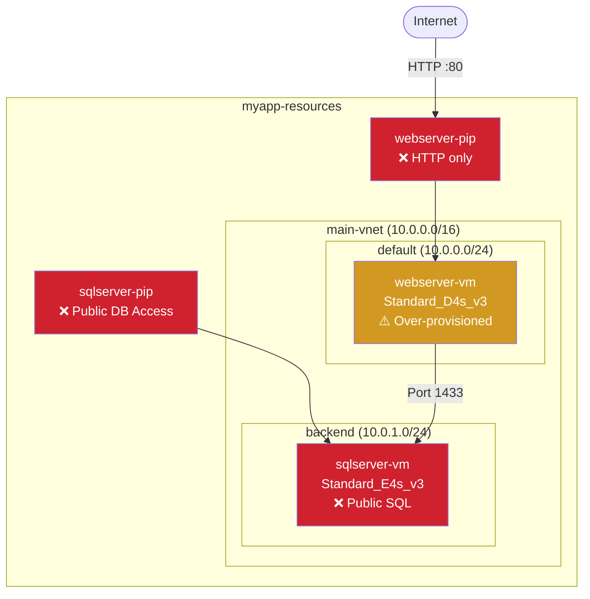
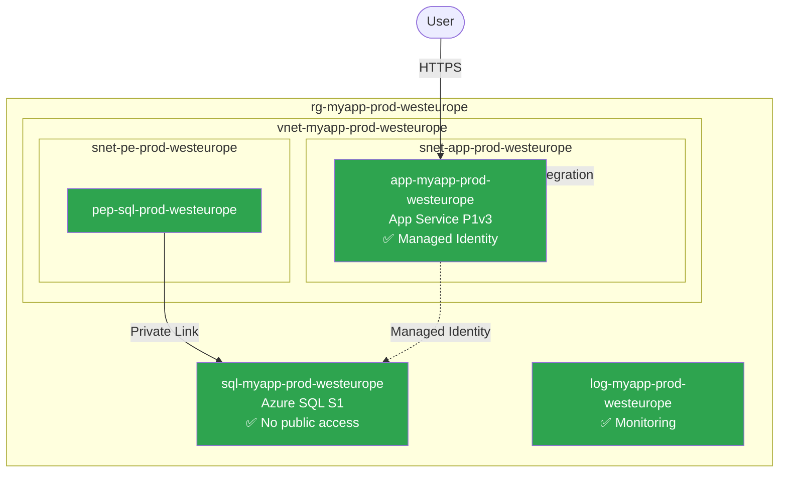

# Sample Walkthrough: Use Case 2 — Agentic Discovery

> **Don't want to build your own agentic template?** Follow this step-by-step guide to execute the pre-built discovery workflow using the example agents and prompts included in this repo.

---

## What You'll Use

| Asset | Location | Purpose |
|---|---|---|
| **Agents** | `.github/agents/` | `@discoverer`, `@reviewer`, `@reporter`, `@migration-planner` |
| **Prompts** | `.github/prompts/` | `disc-1-discover` through `disc-5-full-pipeline` |
| **MCP Servers** | `.vscode/mcp.json` | Azure MCP (resource scanning), Learn MCP (WAF/CAF docs) |

## Agent Workflow

```
@discoverer → @reviewer → @reporter → @migration-planner (optional)
```

**Shortcut**: `disc-5-full-pipeline` runs steps 1-3 (and optionally 4) in a single prompt.

---

## Prerequisites

Before starting, you need:
- [ ] An Azure subscription with resources already deployed (the "brownfield" environment)
- [ ] Azure CLI authenticated (`az login`)
- [ ] Azure MCP server connected (verify in Copilot Chat)
- [ ] Know which resource group(s) to scan

---

## Step 1: Discover the Azure Environment

**Run prompt**: `disc-1-discover`

This invokes `@discoverer` using the Azure MCP server to scan your subscription.

**What it scans**:
| Category | Resources Discovered |
|---|---|
| **Resource Groups** | Names, locations, tags, resource counts |
| **Compute** | VMs, App Services, Container Apps, Functions — SKUs, sizes, OS |
| **Networking** | VNets, subnets, NSGs, public IPs, private endpoints, load balancers |
| **Data** | SQL databases, Storage accounts, Cosmos DB, Redis — SKUs, access settings |
| **Security** | Key Vaults, managed identities, role assignments |
| **Monitoring** | Log Analytics, App Insights, diagnostic settings, alerts |

**What it produces**: `docs/discovery-inventory.md` containing:
- Executive summary (total resources, resource groups scanned)
- Resource group overview table
- Detailed inventory per category
- Network topology snapshot
- Security posture snapshot

**Verify before continuing**:
- [ ] Inventory file exists and lists all discovered resources
- [ ] Resource counts match what you see in the Azure portal
- [ ] Network topology shows VNets, subnets, and connectivity
- [ ] Public IPs and endpoints are flagged

---

## Step 2: Assess Against WAF & CAF

**Run prompt**: `disc-2-assess`

This invokes `@reviewer` to evaluate the discovered environment against Well-Architected Framework and Cloud Adoption Framework:

**What it evaluates**:

### WAF Pillars
| Pillar | What It Checks |
|---|---|
| **Reliability** | Zone redundancy, health probes, auto-scaling, backup/restore, SLA |
| **Security** | Public endpoints, NSG rules, managed identities, TLS enforcement, secrets management |
| **Cost Optimization** | SKU sizing, unused resources, auto-scaling, reserved instances |
| **Operational Excellence** | IaC coverage, monitoring, alerting, diagnostic settings, tags |
| **Performance Efficiency** | SKU tiers, caching, connection pooling, CDN usage |

### CAF Compliance
| Check | What It Audits |
|---|---|
| Naming conventions | All resources against CAF patterns (`app-`, `sql-`, `vnet-`, etc.) |
| Required tags | `environment`, `workload`, `owner`, `costCenter` on every resource |
| Resource organization | Logical grouping by workload and environment |

**What it produces**: `docs/waf-assessment.md` containing:
- Overall health score (0-100%)
- WAF compliance matrix with ✅ Compliant / ⚠️ Partial / ❌ Non-Compliant per pillar
- Per-pillar detailed analysis with findings
- CAF compliance report (naming score, tagging score)
- Security findings prioritized P1 (Critical) through P4 (Low)
- Top 10 recommendations with effort estimates

**Verify before continuing**:
- [ ] Assessment has a health score
- [ ] All 5 WAF pillars are rated
- [ ] Security findings are categorized by severity
- [ ] Recommendations are prioritized and actionable

---

## Step 3: Generate the Discovery Report

**Run prompt**: `disc-3-report`

This invokes `@reporter` to synthesize everything into an executive report with visual diagrams:

**What it produces**: `docs/discovery-report.md` containing:

### Mermaid Diagrams (2-4 diagrams)

1. **Architecture Overview** (`graph TB`) — All resources grouped by resource group, VNet, and subnet boundaries
2. **Network Topology** (`graph LR`) — Connectivity between subnets, public endpoints, private endpoints
3. **Security Boundaries** — Trust zones, NSG rules, identity flows
4. **Data Flow** — How data moves between compute and storage

### Compliance Color Coding
- 🟢 Green nodes = Compliant resources
- 🟠 Orange nodes = Partial compliance (needs attention)
- 🔴 Red nodes = Non-compliant (security risk or gap)

### Report Sections
- Executive summary for stakeholders
- Environment profile (subscription, regions, resource counts)
- WAF dashboard (visual pillar ratings)
- CAF compliance summary
- Risk register (ranked by impact and likelihood)
- Top 10 recommendations with effort/impact matrix

**Example architecture diagram**:


**Verify before continuing**:
- [ ] Report has at least 2 Mermaid diagrams
- [ ] Diagrams use compliance color coding
- [ ] Resource names and SKUs are shown in node labels
- [ ] All public endpoints are flagged as risks
- [ ] Recommendations have clear effort/impact ratings

---

## Step 4 (Optional): Plan PaaS Migration

**Run prompt**: `disc-4-migration`

This invokes `@migration-planner` to design a PaaS migration path:

**What it produces**: `docs/migration-plan.md` containing:

### IaaS → PaaS Mapping
| Current (IaaS) | Target (PaaS) | Rationale |
|---|---|---|
| VM (web server) | App Service | Managed, auto-scaling, no OS patching |
| VM (SQL Server) | Azure SQL Database | Managed, built-in HA, automated backups |
| Public IPs | Private Endpoints | Eliminate public exposure |
| Manual monitoring | App Insights + Log Analytics | Integrated APM and diagnostics |

### 4-Phase Roadmap
| Phase | Focus | Duration |
|---|---|---|
| Phase 0 | Foundation (VNet, DNS, Key Vault) | Week 1 |
| Phase 1 | Data migration (SQL VM → Azure SQL) | Week 2 |
| Phase 2 | Compute migration (VM → App Service) | Week 3 |
| Phase 3 | Optimization (monitoring, scaling, cleanup) | Week 4 |

### Additional Content
- Target architecture Mermaid diagram (all green/compliant nodes)
- Phase dependency diagram
- Cost comparison: current monthly vs target monthly with savings %
- Risk assessment with mitigation per phase
- Rollback plan for each phase
- Success criteria and definition of done

**Example target architecture**:


---

## Alternative: Run the Full Pipeline

**Run prompt**: `disc-5-full-pipeline`

This runs Steps 1-3 (and optionally 4) in a single prompt. The `@discoverer` agent orchestrates the full sequence:

1. Discovers all resources → `docs/discovery-inventory.md`
2. Assesses against WAF/CAF → `docs/waf-assessment.md`
3. Generates executive report → `docs/discovery-report.md`
4. (Optional) Creates migration plan → `docs/migration-plan.md`

Use this when you want the complete pipeline without running each step separately.

---

## Expected Final Output

After completing all steps, your repo should contain:

```
docs/
├── discovery-inventory.md    # Complete resource inventory
├── waf-assessment.md         # WAF/CAF compliance assessment
├── discovery-report.md       # Executive report with Mermaid diagrams
└── migration-plan.md         # PaaS migration plan (optional)
```

Each document builds on the previous — the inventory feeds into the assessment, which feeds into the report, which feeds into the migration plan.
